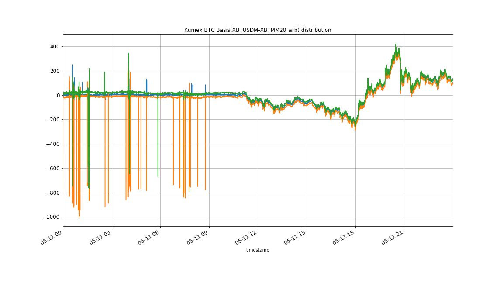
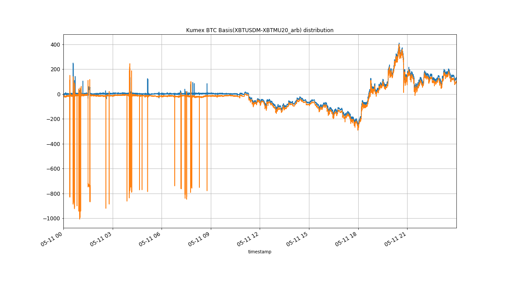

# market-analysis-futures-swap
Analysis of kumex futures and kumex swap

# analysis
* Day: 2020-05-11
---
## Kumex BTC Basis(XBTUSDM - XBTMM20) distribution

## Kumex BTC Basis(XBTUSDM - XBTMU20) distribution

## Analysis
-|XBTUSDM|XBTUSDM-XBTMU20_arb|XBTUSDM-XBTMM20_arb
---|---|---|---
mean | 8687.735658963315 | -15.304411172394518 | 18.344999671206754
std | 140.1532062853815 | 98.61379024621405 | 82.44436853697951
min | 8250.5 | -1007.0 | -765.5
25% | 8593.5 | -21.0 | 7.0
50% | 8705.5 | -14.0 | 16.5
75% | 8758.5 | -9.0 | 23.5
max | 9176.5 | 401.0 | 430.0

ps: 
`mean`: 均值
`std`: 标准差
`25%`: 分位数
`50%`: 中位数
`25%`: 分位数
`max`: 最大值